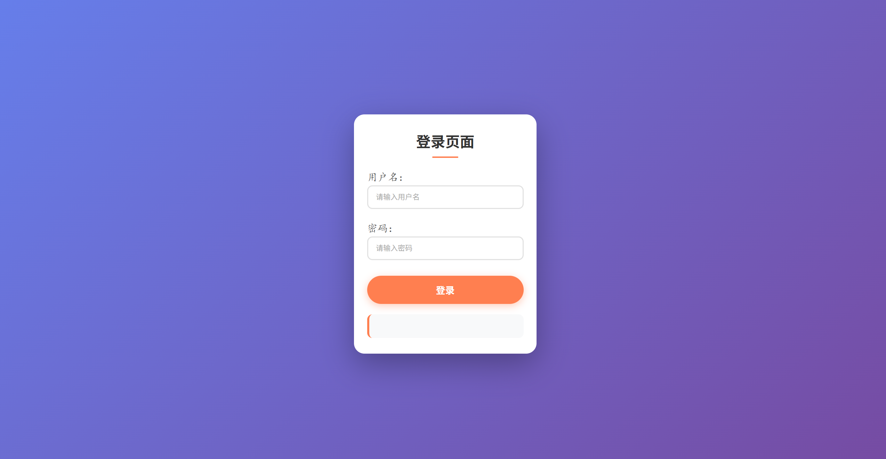
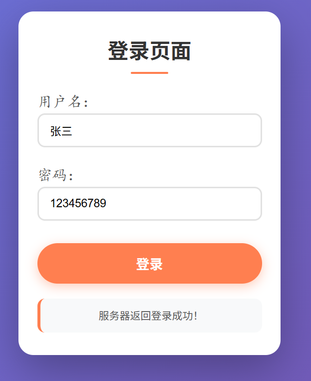
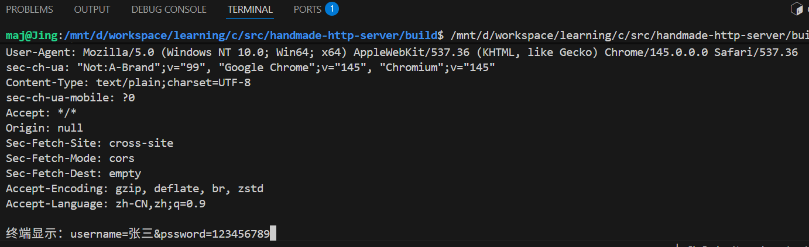

# 🚀 handmade-http-server

这是一个结合了 **C 语言底层网络编程** 与 **前端 Web 交互** 的入门级练习。它模拟了一个简单的 HTTP 服务器，能够接收网页端的登录请求并返回数据。

## 📂 练习文件说明 

*   `server.c`: 后端程序。使用 C 语言编写，处理 Socket 连接、多进程分发及 HTTP 协议解析。
*   `login.html`: 前端页面。包含美化后的登录表单，使用 JavaScript 的 `fetch` API 与后端通信。
*   `unp.h`: 依赖头文件（基于《Unix网络编程》环境）。
*   `unp.c`:存放server.c里用到的函数定义。
---

## 🛠️ 如何在 VS Code 中运行

### 1. 启动后端服务器
在终端（Terminal）中用Cmake编译并运行 C 程序：服务器将开始在 9877 端口监听请求。
###  2.测试交互
在网页输入用户名和密码，点击登录。
你会在：

网页端：看到“服务器返回：登录成功！”。

服务器终端：看到浏览器发来的解析好的账号和密码。
## 🛠️ 技术要点

### 后端实现 (C & Socket)
- [x] **Socket 基础**：实现了标准的 Socket、Bind、Listen 和 Accept 流程。
- [x] **并发处理**：使用 `fork()` 实现多进程并发，父进程负责监听，子进程负责处理具体请求。
- [x] **粘包处理**：封装了 `readline` 和 `writen` 函数，确保 TCP 字节流读取的完整性。
- [x] **信号处理**：通过 `SIGCHLD` 信号配合 `waitpid` 自动回收子进程，彻底杜绝僵尸进程。
- [x] **协议解析**：手动解析 HTTP 请求头，识别 `Content-Length` 并精准读取 Body 数据。
- [x] **跨域支持**：在响应头中手动添加 `Access-Control-Allow-Origin: *`，解决浏览器的跨域限制。

### 前端实现 (HTML & JS)
- [x] **异步交互**：使用现代 JavaScript 的 `fetch` 接口与后端进行非阻塞通信。
- [x] **UI 设计**：使用 CSS3 线性渐变、圆角阴影以及 Flexbox 布局打造现代化登录界面。
- [x] **异常捕获**：前端加入了 `try...catch` 机制，当服务器未运行或连接失败时能给出友好提示。
---
## 🛠️效果展示
**前端效果展示图：**

**终端展示:**

